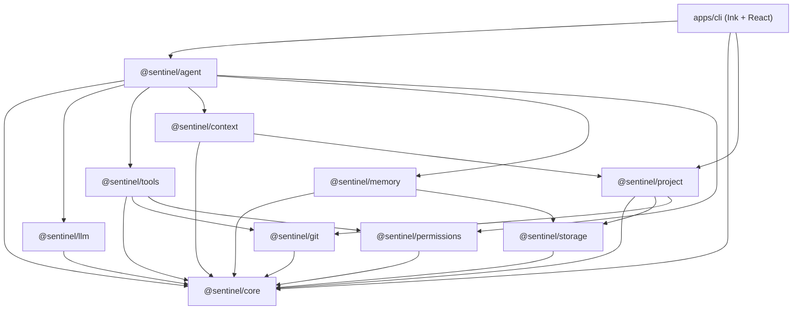

# Sentinel Architecture Document

## 1. High-Level Vision & Mission

Sentinel is designed from the ground up as a software development agent capable of modeling application behavior across the entire stack:
```text
User Interaction → UI Component → Action / Event → API Request → Controller / Route
→ Validation → Business Logic → Database / Storage → Side Effects → Response → Client State
```

Phase 1 establishes the rock-solid modular foundations and an interactive CLI MVP.

---

## 2. Layered Architecture

Sentinel strictly enforces dependency separation between interface, orchestration, models, tools, and storage:



---

## 3. Package Responsibilities

### `@sentinel/core`
- Defines branded semantic types (`ToolCallId`, `SessionId`, `AbsolutePath`).
- Typed error hierarchy (`ModelError`, `ToolExecutionError`, `PermissionError`, `GitError`, etc.).
- Structured JSON Logger with secret sanitization.
- Hierarchical configuration loader (`defaults` -> `.sentinel/config.json` -> `env`).
- In-process typed `EventBus` and `MetricsCollector`.

### `@sentinel/llm`
- Decouples the agent kernel from any specific LLM provider.
- `LLMProvider` interface with streaming and blocking chat methods.
- OpenAI adapter (works with any OpenAI-compatible endpoint via `SENTINEL_BASE_URL`).
- Anthropic Claude adapter.
- `ProviderRegistry` for dynamic provider discovery.

### `@sentinel/tools`
- `ToolRegistry` and `Tool` interface.
- Filesystem tools with path-traversal prevention.
- Controlled shell command runner with timeouts and output truncation.
- Git tools wrapping Git client.

### `@sentinel/permissions`
- Three-tier permission model (`safe`, `confirm_recommended`, `confirm_required`).
- Command blocklist for dangerous operations (`rm -rf /`, fork bombs, etc.).
- UI confirmation hooks.

### `@sentinel/project`
- Tech stack auto-detection (languages, frameworks, package managers, test runners, git).
- AST / regex-based structural analyzer (extracts functions, classes, interfaces, routes, React components).
- Fast glob file scanner honoring `.gitignore`.

### `@sentinel/context`
- Relevance scoring based on tokenization, symbol matching, and recency.
- Token budget management and context truncation.

### `@sentinel/memory`
- `SessionMemory`: Short-term context, working files, facts, recent errors.
- `ProjectMemory`: Persistent facts stored in `StorageAdapter`.
- `ToolHistory`: Condensed operational history.

### `@sentinel/agent`
- `AgentKernel`: Orchestrates the `reason -> act -> observe -> adapt` loop.
- `AgentSession`: State container for multi-turn conversations.
- `VerificationEngine`: Post-modification test runner and diagnostic error parser.

### `apps/cli`
- Terminal UI powered by Ink and React.
- Streaming message view, live tool activity indicators, interactive confirmation dialogs, and slash command dispatcher.
